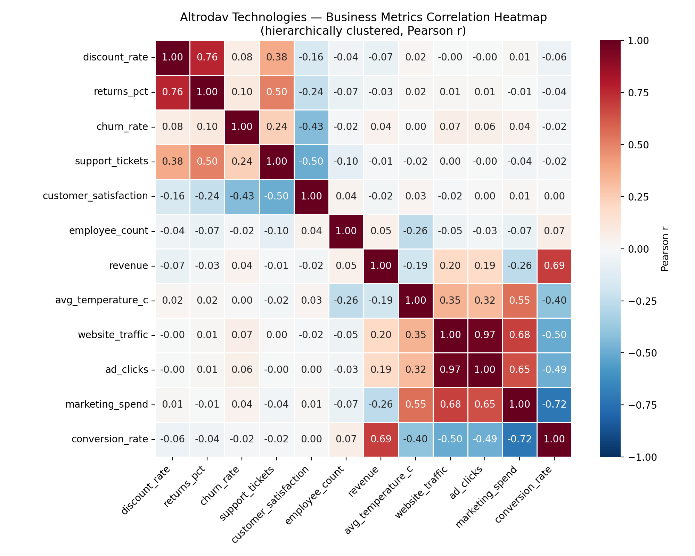

# Task 11 — Correlation & Heatmaps: Interpretation Report

Data source: `altrodav_business_metrics.csv` · 731 clean rows · 12 numeric variables

### Key relationships worth acting on

**Plausible drivers to act on:**
- `website_traffic` ↔ `ad_clicks`: r = +0.97 (positive). Ad clicks are largely a subset of total traffic-generating activity, so this pair is expected to move together almost by construction — a strong candidate for multicollinearity rather than two independent signals.
- `discount_rate` ↔ `returns_pct`: r = +0.76 (positive). Deeper discounts are associated with more impulse/low-commitment purchases, which are more often returned — plausible driver.
- `marketing_spend` ↔ `conversion_rate`: r = -0.72 (negative). Negative relationship: as spend scales up, campaigns likely reach further into lower-intent audiences, diluting conversion quality — a plausible 'diminishing returns' story, but worth confirming against campaign-level targeting data before treating spend cuts as a fix.
- `revenue` ↔ `conversion_rate`: r = +0.69 (positive). Revenue is mechanically a function of traffic and conversion rate, so this positive link is expected by construction rather than a separate discovery — flagged here mainly as a modelling reminder, not a new lever.
- `marketing_spend` ↔ `website_traffic`: r = +0.68 (positive). Marketing spend buys ads/campaigns that directly drive site visits — a plausible, mechanistic driver relationship.
- `marketing_spend` ↔ `ad_clicks`: r = +0.65 (positive). Marketing spend plausibly buys some of these clicks directly, but this pair overlaps heavily with marketing_spend↔website_traffic and website_traffic↔ad_clicks — likely a secondary effect of the same underlying chain rather than an independent relationship.

**Multicollinearity to prune before modelling (VIF > 5):**
- `website_traffic`: VIF = 22.9
- `ad_clicks`: VIF = 16.8
- `conversion_rate`: VIF = 11.4
- `revenue`: VIF = 8.2